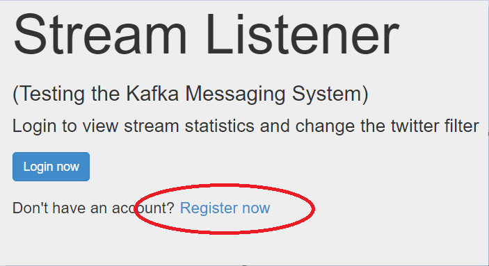
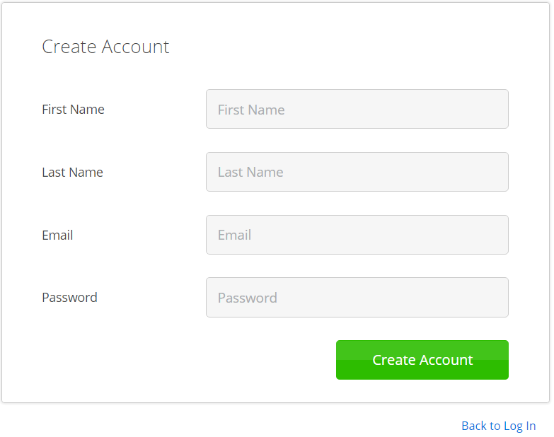
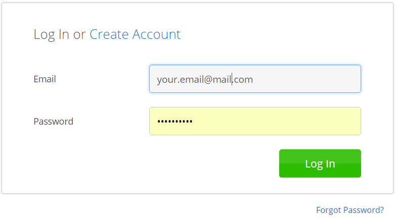
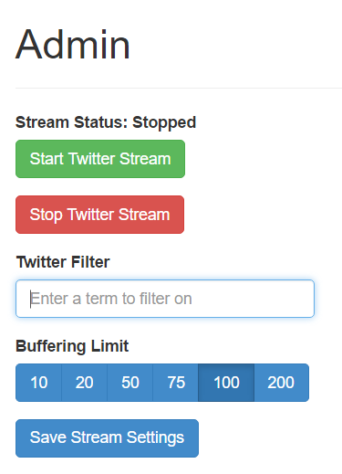
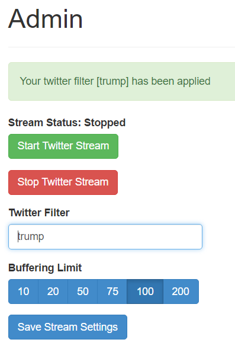
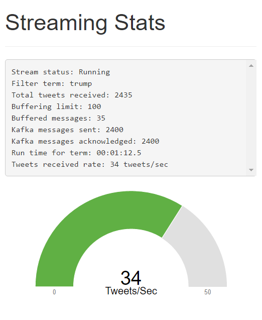

# Sample Node.js / Kafka / Twitter Stream App

twitter-stream-kafka-producer is a sample node app that makes use of [kafka-node](https://www.npmjs.com/package/kafka-node) libraries to publish [twitter](https://www.npmjs.com/package/node-tweet-stream) streams to a kafka server. It makes use of [express](http://expressjs.com/) for application endpoint management,  [stormpath](https://stormpath.com/) for user management, [pug](https://github.com/pugjs) as the template engine, [C3](http://c3js.org/) for charts, and [socket.io](http://socket.io/).  


## Getting Started

This project makes use of [Stormpath](https://stormpath.com/) for user management. Create a new Stormpath account: [https://api.stormpath.com/register](https://api.stormpath.com/register). 

Follow their [setup](https://docs.stormpath.com/nodejs/express/latest/setup.html) instructions to get your API keys to create your .env file. You'll also need to add your own [twitter](https://apps.twitter.com/) API key to the .env file.
  
Set up these following variables with your own keys in a `.env` file:

```
STORMPATH_CLIENT_APIKEY_ID=Learn how to get your APIKEY at https://docs.stormpath.com/nodejs/product-guide/latest/quickstart.html
STORMPATH_CLIENT_APIKEY_SECRET=Learn how to get your APIKEY SECRET at https://docs.stormpath.com/nodejs/product-guide/latest/quickstart.html
STORMPATH_APPLICATION_HREF=Learn how to Setup your application at https://docs.stormpath.com/nodejs/product-guide/latest/quickstart.html#retrieve-your-application

TWITTER_CONSUMER_KEY=Get a consumer key: https://apps.twitter.com/
TWITTER_CONSUMER_SECRET=Get a consumer key secret: https://apps.twitter.com/
TWITTER_ACCESS_KEY=Get an access key: https://apps.twitter.com/
TWITTER_ACCESS_SECRET=Get an access key secret: https://apps.twitter.com/
```
Install the required libraries via npm:

    npm install

You will need to have a Kafka server running. The [Kakfa Quickstart](http://kafka.apache.org/quickstart)
documentation explains how to do this step-by-step.

With Kafka now running and your environment variables properly configured, start the node application:

```
npm run start-[windows|linux] // depending on your environment
```

Now [login](http://localhost:3001/login) and create a user. 





With a user created, you can now login to view your profile.



Once your user is created, login to the [Stormpath](https://api.stormpath.com/) console and create an `admins` group. Add yourself to this `admins` group.

Now you will have access to the [admin page](http://localhost:3001/admin).



On the [admin page](http://localhost:3001/admin), set the term you would like to filter tweets by. 



Then select the "Start Twitter Stream" button.

Use the [stats page](http://localhost:3001/stats) to verify that tweet messages are being processed.



To view the messages in kafka run the `kafka-console-consumer[.sh or .bat]` command:

```
./kafka-console-consumer[.sh or .bat] --zookeeper localhost:2181 --topic twitter --from-beginning
```

Now you are ready to create your Node microservices that consume kafka messages published to the `twitter` topic.